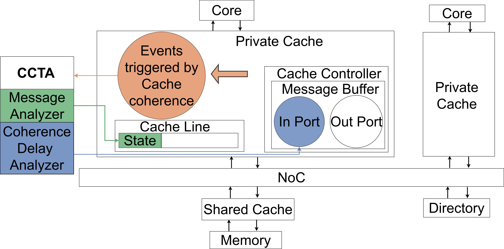
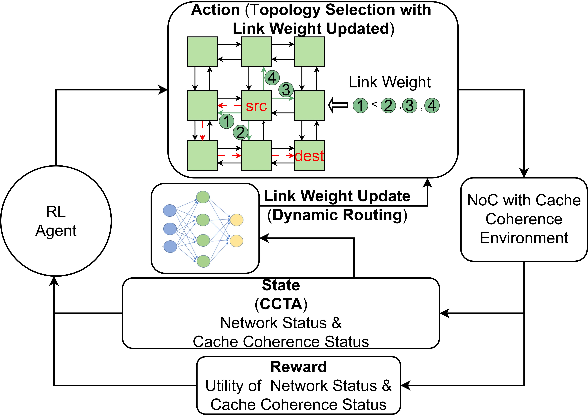

#Learning Cache Coherence Traffic for NoC Routing Design
-------------------------------------------------------------------------------------------------------------
Our work consists of two major components: (1) the Cache Coherence Traffic Analyzer (CCTA), an analysis tool fully integrated with Gem5 \cite{b17} for evaluating cache coherence performance in realistic scenarios; and (2) a DRL-based routing approach that not only optimally selects topologies and routing paths, but also integrates cache coherence features captured by CCTA into the routing design, enabling dynamic adaptation to network structure and coherence traffic characteristics.

  
  

#How to use it
-------------------------------------------------------------------------------------------------------------

These directories follow the structure of Gem5 to make it more convenient for users to implement our design.
Revise the codes in the src folder of Gem5 to integrate the CCTA tool for capturing metrics.
For the routing, run the drl_Qlearning_wu2.py by using python configs/main/drl_Qlearning_wu2.py. 

#Results
-------------------------------------------------------------------------------------------------------------

Please refer to the paper.

#Project Information
-------------------------------------------------------------------------------------------------------------

Copyright (c) HP-NTU Digital Manufacturing Corporate Lab, Nanyang Technological University, Singapore.

If you find our model helps your research, please consider citing it: 

Guochu Xiong, Xiangzhong Luo, and Weichen Liu. 2025. Learning Cache Coherence Traffic for NoC Routing Design. In Great Lakes Symposium on VLSI 2025 (GLSVLSI '25), June 30--July 2, 2025, New Orleans, LA, USA. ACM, New York, NY, USA, 7 pages. https://doi.org/10.1145/3716368.3735166

Contributors: Guochu Xiong, Xiangzhong Luo and Weichen Liu.

If you have any comments, questions, or suggestions please create an issue on github or contact us via email.

Guochu Xiong<guochu [DOT] xiong [AT] ntu [DOT] edu [DOT] sg>

